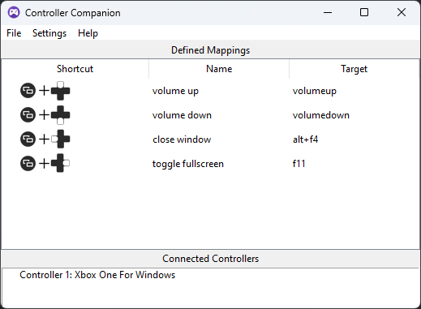
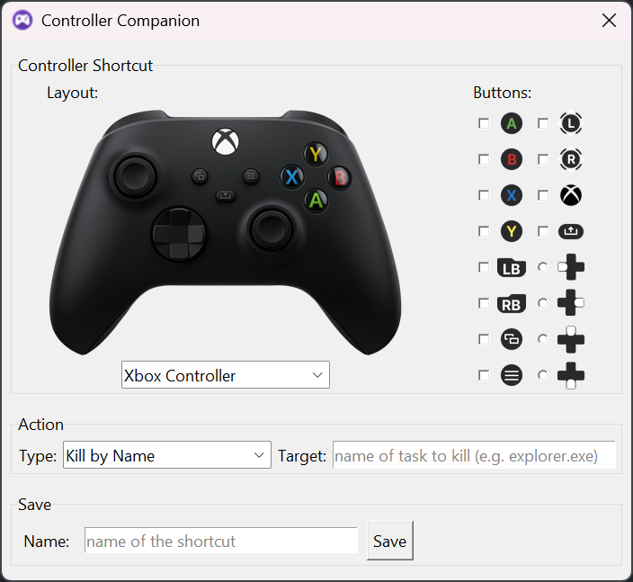

# Controller Companion

Easily map controller shortcuts to an action.
The following actions are supported:
- Kill a task by its name.
- Execute a keyboard shortcut.
- Execute an arbitrary console command.

## Features
- GUI and CLI options available
- Supports a wide variety of controllers (those supported by [pygame](https://www.pygame.org))
- Runs on Windows, Linux and Mac
- Auto start on system boot (windows only for now)
- GUI app can be compiled as a standalone executable (using [PyInstaller](https://pyinstaller.org)

## Screenshots
### Main Window

### Create a new shortcut 

